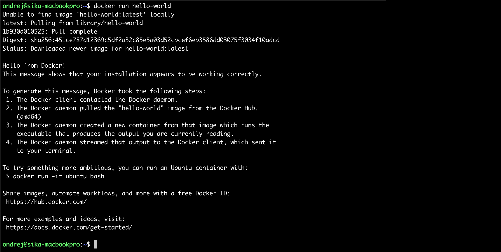
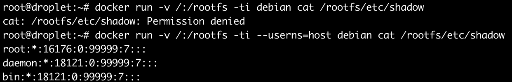
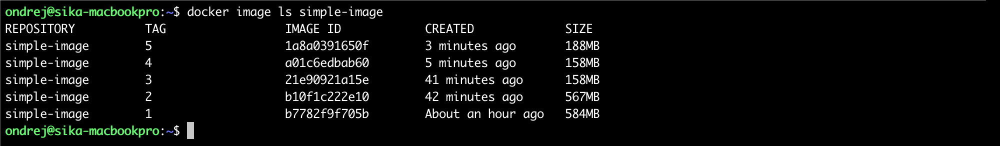
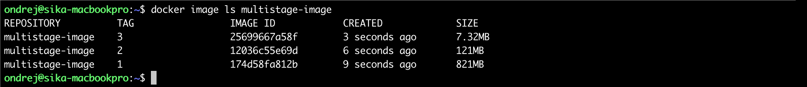
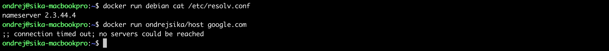

[Ondrej Sika (sika.io)](https://sika.io) | <ondrej@sika.io> | [go to course ->](#course) | [install docker ->](#install-docker)


# Docker Training

    Ondrej Sika <ondrej@ondrejsika.com>
    https://github.com/ondrejsika/docker-training

My Docker course with code examples.

## About Course

- [Docker Training in Czech Republic](https://ondrej-sika.cz/skoleni/docker?_s=gh-dte)
- [Docker Training in Europe](https://ondrej-sika.com/training/docker?_s=gh-dte)

### Any Questions?

Write me mail to <ondrej@sika.io>

### Related Repositories

#### Traefik

- https://github.com/ondrejsika/traefik-le
- https://github.com/ondrejsika/traefik-ssl

#### Related courses

- https://github.com/ondrejsika/kubernetes-training-examples
- https://github.com/ondrejsika/bare-metal-kubernetes

### Lecturer notes

#### Download Images before course, prevent slow connections

```
./pull-images.sh
```

If you want update list of used images in file `images.txt`, run `./save-image-list.sh` and remove locally built images.

## Course

## About Me - Ondrej Sika

**Freelance DevOps Engineer, Consultant & Lecturer**

- Complete DevOps Pipeline
- Open Source / Linux Stack
- Cloud & On-Premise
- Technologies: Git, Gitlab, Gitlab CI, Docker, Kubernetes, Terraform, Prometheus, ELK / EFK, Rancher, Proxmox

## Star, Create Issues, Fork, and Contribute

Feel free to star this repository or fork it.

If you found bug, create issue or pull request.

Also feel free to propose improvements by creating issues.

## Live Chat

For sharing links & "secrets".

<https://tlk.io/sika-docker>

## What is Docker?

Docker is an open-source project that automates the deployment of applications inside software containers ...

Docker containers wrap up a piece of software in a complete filesystem that contains everything it needs to run: code, runtime, system tools, system libraries – anything you can install on a server.

## Containers vs virtualization

### Virtualization

A VM is an abstraction of physical hardware. Each VM has a full server hardware stack from virtualized BIOS to virtualized network adapters, storage, and CPU.

That stack allows run any OS on your host but it takes some power.

### Containers

Containers are abstraction in linux kernel, just proces, memory, network, … namespaces.

Containers run in same kernel as host - it is not possible use different OS or kernel version, but containers are much more faster than VMs.

## Docker Advantages

- Performance
- Management
- Application (image) distribution

## Docker Disadvantages

- Security
- One kernel / "Linux only"

## Usage of Docker

- Almost everywhere
- Development, Testing, Production
- Better (easier, faster) deployment process
- Separates running applications

## Docker works with

- Kubernetes ([Kubernetes Training](https://github.com/ondrejsika/kubernetes-training))
- Swarm

## Docker Editions (CE / EE)

### Docker Engine Community

Docker CE is ideal for individual developers and small teams looking to get started with Docker and experimenting with container-based apps.

### Docker Engine Enterprise

Docker Engine - Enterprise is designed for enterprise development of a container runtime with security and an enterprise grade SLA in mind.

### Docker Enterprise

Docker Enterprise is designed for enterprise development and IT teams who build, ship, and run business critical applications in production at scale.

Source: https://docs.docker.com/install/overview/

## 12 Factor Apps

[12factor.net](https://12factor.net)

Set of 12 rules how to write modern applications.

## Install Docker

- Official installation - <https://docs.docker.com/engine/installation/>
- My install instructions (in Czech) - <https://ondrej-sika.cz/docker/instalace/>
- Bash Completion on Mac - <https://blog.alexellis.io/docker-mac-bash-completion/>

## Test the installation

```
docker run hello-world
```



### Remote Docker (over SSH)

You can use remote Docker using SSH. Just export varibale `DOCKER_HOST` with `ssh://root@docker.sikademo.com` and your local Docker clint will be executed on docker.sikademo.com server.

```
export DOCKER_HOST=ssh://root@docker.sikademo.com
docker version
docker info
```

You can connect Docker using TCP socket, see chapter [Connect Shell to the Machine](#connect-shell-to-the-machine)

## Basic Usage

## Image and Container

An **image** is an inert, immutable, file that's essentially a snapshot of a container. Images are created with the build command, and they'll produce a **container** when started with run. Images are stored in a Docker registry.

## System Wide Info

- `docker version` - print version
- `docker info` - system wide information
- `docker system df` - docker disk usage
- `docker system prune` - cleanup unused data

## Docker Images

- `docker pull <image>` - download an image
- `docker image ls` - list all images
- `docker image ls -q` - quiet output, just IDs
- `docker image ls <image>` - list image versions
- `docker image rm <image>` - remove image
- `docker image history <image>` - show image history
- `docker image inspect <image>` - show image properties

## Docker Registry

Docker image name also contains location of it source. Those names can be used:

- `debian` - Official images on Docker Hub
- `ondrejsika/debian` - User (custom) images on Docker Hub
- `reg.istry.cz/debian` - Image in my own registry

### Own Docker Registry

**Docker Registry** is build in **Gitlab** and **Github** for no additional cost. You can find it in packages section.

You can run registry manually using this command:

```
docker run -d -p 5000:5000 --restart=always --name registry registry:2
```

See full deployment configuration here: <https://docs.docker.com/registry/deploying/>

### Docker Registry in Self-Hosted Gitlab

You have to add `registry_external_url` to Your Gitlab config and reconfigure.

```
echo "registry_external_url 'registry.example.com'" >> /etc/gitlab/gitlab.rb
gitlab-ctl reconfigure
```

### Registry Client - Reg

I use [reg](https://github.com/genuinetools/reg) for CLI and Web client. Work only with open source registry, Docker Hub use different API.

#### Install Reg

From their release page on Github: <https://github.com/genuinetools/reg/releases>

#### CLI

```
reg ls <registry>
```

Example

```
reg ls reg.istry.cz
```

#### Web

```
reg server -r <registry>
```

Example

```
reg server -r reg.istry.cz
```

See <http://127.0.0.1:8080>

## Docker Run

```
docker run [ARGS] <image> [<command>]
```

Examples

```
# Basic Docker Run
docker run hello-world

# With custom command
docker run debian cat /etc/os-release
docker run ubuntu cat /etc/os-release

# With TTY & Standart Input
docker run -ti debian
```

## Containers

- `docker ps` - list containers
- `docker start <container>`
- `docker stop <container>`
- `docker restart <container>`
- `docker rm <container>` - remove container

## Common Docker Run Params

- `--name <name>`
- `--rm` - remove container after stop
- `-d` - run in detached mode
- `-ti` - map TTY a STDIN (for bash eg.)
- `-e <variable>=<value>` - set ENV variable
- `--env-file=<env_file>` - load all variables defined in ENV file

## Restart Policy

By default, if container process stop (or fail), container will be stopped.

You can choose another behavion using argument `--restart <restart policy>`.

- `--restart on-failure` - restart only when container return non zero return code
- `--restart always` - always, even on Docker daemon restart (server restart also)
- `--restart unless-stopped` - similar to always, but keep stopped container stopped on Docker daemon restart (server restart also)

If you want to set maximum restart count for `on-failure` restart policy, you can use: `--restart on-failure:<count>`

## List Containers

- `docker ps` - list running containers
- `docker ps -a` - list all containers
- `docker ps -a -q` - list IDs of all containers

Example of `-q`

```
docker rm -f $(docker ps -a -q)
```

or my `dra` (docker remove all) alias

```
alias dra='docker ps -a  -q | xargs docker rm -f'
dra
```

## Docker Exec

```
docker exec <container> <command>
```

Arguments

- `-d` - run in detached mode
- `-e <variable>=<value>` - set ENV variable
- `-ti` - map TTY a STDIN (for bash eg.)
- `-u <user>` - run command by specific user

Example

```
docker run --name pg11 -e POSTGRES_PASSWORD=pg -d postgres:11
docker exec -ti -u postgres pg11 psql

docker run --name pg12 -e POSTGRES_PASSWORD=pg -d postgres:12
docker exec -ti -u postgres pg12 psql
```

## Docker Logs

```
docker logs [-f] [-t] <container>
```

Args

- `-f` - following output (similar to `tail -f ...`)
- `-t` - show time prefix

Examples

```
docker run --name loop -d ondrejsika/infinite-counter
docker logs loop
docker logs -t loop
docker logs -f loop
docker logs -ft loop
```

### Log Drivers

You can use native Docker logging or some log drivers.

For example, if you want to log into syslog, you can use `--log-driver syslog`.

You can send logs directly to **ELK** (EFK) or Graylog using **gelf**. For elk logging you have to use `--log-driver gelf –-log-opt gelf-address=udp://1.2.3.4:12201`.

See the logging docs: <https://docs.docker.com/config/containers/logging/configure/>

### Json File (Default Log Driver)

Log Driver options:

- `max-size` - Max size of log file (default `-1` - unlimited), use for example `100k` for kB, `10m` for MB or `1g` for GB.
- `max-file` - Nuber of log rotated files (default `1`)
- `compress` - Compression for rotated logs (default `disabled`)

Examle:

```
docker run --name log-rotation -d --log-opt max-size=1k --log-opt max-file=5 ondrejsika/log-rotation
```

## Docker Inspect

Get lots of information about container in JSON.

```
docker inspect <container>
```

### Inspect Format

Using Go Template Language.

Examples:

```
docker inspect log-rotation --format "{{.NetworkSettings.IPAddress}}"
```

```
docker inspect log-rotation --format "{{.LogPath}}"
```

## Docker Volumes

[Docs](https://docs.docker.com/storage/volumes/)

- Volumes are persistent data storage for containers.
- Volumes can be shared between containers and data are written directly to host.

CLI

- `docker volume` - all volume management commands
- `docker volume ls` - list all volumes
- `docker volume rm <volume>` - remove volume
- `docker volume prune` - remove all not used (not bount to container) volumes

Examples

- `docker run -ti -v /data debian`
- `docker run -ti -v my-volume:/data debian`
- `docker run -ti -v $(pwd)/my-data:/data debian`

### Volume Drivers

[Docs](https://docs.docker.com/storage/volumes/#use-a-volume-driver)

### SSH FS Volumes

Create SSH FS volume

```
docker volume create --driver vieux/sshfs \
  -o sshcmd=root@sshfs.sikademo.com:/sshfs \
  -o password=asdfasdf \
  sshvolume
```

Use SSH FS volume

```
docker run -ti -v sshvolume:/data debian
```

### NFS Volumes

Create NFS volume

```
docker volume create --driver local --opt type=nfs --opt o=addr=nfs.sikademo.com,rw --opt device=:/nfs nfsvolume
```

Use NFS volume

```
docker run -ti -v nfsvolume:/data debian
```

### Read only volumes

If you want to mount your volumes **read only**, you have to add `:ro` to volume argument.

Examples

- `docker run -ti -v my-volume:/data:ro debian`
- `docker run -ti -v $(pwd)/my-data:/data:ro debian`

First example does't make sense read only.

### Show All Volumes & Mounts for All Containers

```
docker ps -a --format '{{ .ID }}' | xargs -I {} docker inspect -f '{{ .Name }}{{ printf "\n" }}{{ range .Mounts }}{{ printf "\n\t" }}{{ .Type }} {{ if eq .Type "bind" }}{{ .Source }}{{ end }}{{ .Name }} => {{ .Destination }}{{ end }}{{ printf "\n" }}' {}
```

### Find Containers Which Use Specific Volume

```
docker ps -a --filter volume=<volume>
```

Example

```
docker ps -a --filter volume=my-volume
```

### Socket forwading

If you want to forward socket into container, you can also use volume. If you work with sockets, read only parameter doesn't work.

```
docker run -v /var/run/docker.sock:/var/run/docker.sock docker docker ps
```

or

```
docker run -v /var/run/docker.sock:/var/run/docker.sock -ti docker
```

### !! Possible Security Risk !!

**You can mount your's host rootfs to container with root privileges. Everybody ho has access to docker or docker socket has root privileges on your host.**

**userns-remap can fix that**

`docker run -v /:/rootfs -ti debian`

## userns-remap

Docker can remap root user from container to hight-number user on host.

More: <https://docs.docker.com/engine/security/userns-remap/>

### Enabble userns-remap

dockerd argument

```
dockerd --userns-remap="default"
```

Config `/etc/docker/daemon.json`

```json
{
  "userns-remap": "default"
}
```

### Examples

```
docker run -v /:/rootfs -ti debian cat /rootfs/etc/shadow
```

```
docker run -v /:/rootfs -ti --userns=host debian cat /rootfs/etc/shadow
```



## Docker In Docker

Run Docker in Docker

```
docker run --name docker -d --privileged docker:dind
```

Try run any Docker command in this container:

```
docker exec docker docker info
docker exec docker docker image ls
docker exec docker docker run hello-world
docker exec -ti docker sh
```

## Port Forwarding

Docker can forward specific port from container to host

```
docker run -p <host port>:<cont. port> <image>
```

You can specify an address on the host as well

```
docker run -p <host address>:<host port>:<cont. port> <image>
```

Examples

```
docker run -ti -p 8080:80 nginx
docker run -ti -p 127.0.0.1:8080:80 nginx
```

The latter will make connection possible only from localhost.

See <http://127.0.0.1:8080>

## Own Images

## Dockerfile

**Dockerfile** is preferred way to create images.

**Dockerfile** defines each layer of image by some command.

To make image use command `docker build`

## Dockerfile Commands

- `FROM <image>` - define base image
- `RUN <command>` - run command and save as layer
- `COPY <local path> <image path>` - copy file or directory to image layer
- `ADD <source> <image path>` - instead of copy, archives added by add are extracted
- `ENV <variable> <value>` - set ENV variable
- `USER <user>` - switch user
- `WORKDIR <path>` - change working directory
- `VOLUME <path>` - define volume
- `CMD <command>` - command we want to run on container start up. Difference between `CMD` and `ENTRYPOINT` will be exaplain [later](#entrypoint-vs-command)
- `EXPOSE <port>` - Define on which port the conteiner will be listening

## .dockerignore

- Ignore files for docker build process.
- Similar to `.gitignore`

Example of `.dockerignore` for Next.js (Node) project

```.dockerignore
Dockerfile
out
node_modules
.DS_Store
```

## Build Image from Dockerfile

- `docker build <path> -t <image>` - build image
- `docker build <path> -f <dockerfile> -t <image>`
- `docker tag <source image> <target image>` - rename docker image

## Practice

## Simple Image

See [Simple Image](examples/simple-image) example

### Get Source

```
git clone https://github.com/ondrejsika/docker-training
cd docker-training/examples/simple-image
rm Dockerfile Dockerfile.debian
```

### Create Dockerfile (Debian Based)

```Dockerfile
FROM debian:10
WORKDIR /app
RUN apt-get update && \
    apt-get install -y --no-install-recommends python3 python3-pip && \
    rm -rf /var/lib/apt/lists/*
COPY requirements.txt .
RUN pip3 install -r requirements.txt
COPY . .
CMD ["python3", "app.py"]
EXPOSE 80
```

#### Build & Run

```
docker build -t simple-image .
docker run --name simple-image -d -p 8000:80 simple-image
```

See <http://127.0.0.1:8000>

#### Stop & remove container

```
docker rm -f simple-image
```

### Create Dockerfile (Debian Based)

```Dockerfile
FROM python:3.7-slim
WORKDIR /app
COPY requirements.txt .
RUN pip3 install -r requirements.txt
COPY . .
CMD ["python3", "app.py"]
EXPOSE 80
```

#### Build & Run

```
docker build -t simple-image .
docker run --name simple-image -d -p 8000:80 simple-image
```

See <http://127.0.0.1:8000>

#### Stop & remove container

```
docker rm -f simple-image
```

## Image Size Differences

List images and see the difference in image sizes

```
docker image ls simple-image
```



## Hadolint

Hadolint is Dockerfile linter.

Github: <https://github.com/hadolint/hadolint>

### Install & Use Hadolint

Install on Mac

```
brew install hadolint
```

Use hadolint

```bash
hadolint <dockerfile>
```

You can ignore checks & specify trusted registries

```bash
hadolint --ignore DL3003 --ignore DL3006 <dockerfile> # exclude specific rules
hadolint --trusted-registry registry.sikademo.com <dockerfile>
```

### Use from Docker

You can also use Hadolint from Docker

```
docker run --rm -i hadolint/hadolint < Dockerfile
docker run --rm -i hadolint/hadolint hadolint --ignore DL3006 - < Dockerfile
```

or (for PowerShell)

```
cat Dockerfile | docker run --rm -i hadolint/hadolint
cat Dockerfile | docker run --rm -i hadolint/hadolint hadolint --ignore DL3006 -
```

## Build Arguments

Example in Dockerfile

```dockerfile
ARG FROM_IMAGE=debian:9
FROM $FROM_IMAGE
```

```dockerfile
FROM debian
ARG PYTHON_VERSION=3.7
RUN apt-get update && \
    apt-get install python==$PYTHON_VERSION
```

Build using

```
docker build \
  --build-arg FROM_IMAGE=python .
docker build .

docker build \
  --build-arg PYTHON_VERSION=3.6 .
```

See [Build Args](examples/build-args) example.

## Multi Stage Builds

### Dockerfile for multistage builds

```dockerfile
FROM java-jdk as build
RUN gradle assembly

FROM java-jre
COPY --from=build /build/demo.jar .
```

### Build Multistage Images

```bash
# By default, last stage is used
docker build -t <image> <path>

# Select output stage
docker build -t <image> --target <stage> <path>
```

Examples

```
docker build -t app .
docker build -t build --target build .
```

## Practice

## Multistage Image

See [Multistage Image](examples/multistage-image) example

### Get Source

```
cd ../multistage-image
rm Dockerfile
```

### Standard Image

```Dockerfile
FROM golang
WORKDIR /app
COPY app.go .
RUN go build app.go
CMD ["./app"]
EXPOSE 80
```

Build & Run

```
docker build -t multistage-image:1 .
docker run --name multistage-image -d -p 8000:80 multistage-image:1
```

See <http://127.0.0.1:8000>

Stop & remove container

```
docker rm -f multistage-image
```

See the image size

```
docker image ls multistage-image
```

### Multistage Image (based on Debian)

```Dockerfile
FROM golang as build
WORKDIR /build
COPY app.go .
RUN go build app.go

FROM debian:10
COPY --from=build /build/app .
CMD ["/app"]
EXPOSE 80
```

Build & Run

```
docker build -t multistage-image:2 .
docker run --name multistage-image -d -p 8000:80 multistage-image:2
```

See <http://127.0.0.1:8000>

Stop & remove container

```
docker rm -f multistage-image
```

See the image size

```
docker image ls multistage-image
```

### Multistage Image (from Scratch)

If you build you Go app to static binary (no dynamic dependencies), you can create image from scratch - without OS.

```Dockerfile
FROM golang as build
WORKDIR /build
COPY app.go .
ENV CGO_ENABLED=0
RUN go build -a -ldflags \
    '-extldflags "-static"' app.go

FROM scratch
COPY --from=build /build/app .
CMD ["/app"]
EXPOSE 80
```

Build & Run

```
docker build -t multistage-image:3 .
docker run --name multistage-image -d -p 8000:80 multistage-image:3
```

See <http://127.0.0.1:8000>

Stop & remove container

```
docker rm -f multistage-image
```

See the image size

```
docker image ls multistage-image
```



## Docker BuildKit

Docker has new build tool called BuildKit which can speedup your builds. For example, it build multiple stages in parallel and more. You can also extend Dockerfile functionality for caches, mounts, ...

To enable BuildKit, just set environment variable `DOCKER_BUILDKIT` to `1`.

Example

```
export DOCKER_BUILDKIT=1
docker build .
```

or

```
DOCKER_BUILDKIT=1 docker build .
```

If you are on Windows, you can set variable in PowerShell

```powershell
Set-Variable -Name "DOCKER_BUILDKIT" -Value "1"
```

and in CMD

```cmd
SET DOCKER_BUILDKIT=1
```

You can enable BuildKit by default in Docker config file `/etc/docker/daemon.json`:

```json
{ "features": { "buildkit": true } }
```

BuildKit has interactive output by default, if you can use plan, for example for CI, use:

```
docker build --progress=plain .
```

Docker Build Kit comes with new syntax of Dockerfile.

Here is a description of Dockerfile frontend experimental syntaxes - <https://github.com/moby/buildkit/blob/master/frontend/dockerfile/docs/experimental.md>

Example of Build Kit's paralelism

<https://github.com/ondrejsika/ondrejsika-ci-docker>

Example

```Dockerfile
cat > Dockerfile.1 <<EOF
# syntax = docker/dockerfile:experimental
FROM ubuntu
RUN rm -f /etc/apt/apt.conf.d/docker-clean; echo 'Binary::apt::APT::Keep-Downloaded-Packages "true";' > /etc/apt/apt.conf.d/keep-cache
RUN --mount=type=cache,target=/var/cache/apt --mount=type=cache,target=/var/lib/apt \
  apt-get update && apt-get install -y python gcc

EOF

```

Build

```
docker build -t buildkit-example-1 -f Dockerfile.1 .
```

Another Dockerfile which use APT cached packages

```Dockerfile
cat > Dockerfile.2 <<EOF
# syntax = docker/dockerfile:experimental
FROM ubuntu
RUN rm -f /etc/apt/apt.conf.d/docker-clean; echo 'Binary::apt::APT::Keep-Downloaded-Packages "true";' > /etc/apt/apt.conf.d/keep-cache
RUN --mount=type=cache,target=/var/cache/apt --mount=type=cache,target=/var/lib/apt \
  apt-get update && apt-get install -y gcc

EOF

```

Build

```
docker build -t buildkit-example-2 -f Dockerfile.2 .
```

See, packages are in APT cache, no download is needed.

More about BuildKit: <https://docs.docker.com/develop/develop-images/build_enhancements/>

## Entrypoint vs Command

### Dockerized tool (echo)

You have your tool (echo) with default configuration (in command).

```Dockerfile
cat > Dockerfile.1 <<EOF
FROM debian:10
CMD ["echo", "hello", "world"]

EOF

```

Build

```bash
docker build -t echo:1 -f Dockerfile.1 .
```

Run

```bash
# default command
docker run --rm echo:1

# updated command (didn't work)
docker run --rm echo:1 ahoj svete

# properly updated command
docker run --rm echo:1 echo ahoj svete
```

You can split command array to command and entrypoint like:

```Dockerfile
cat > Dockerfile.2 <<EOF
FROM debian:10
ENTRYPOINT ["echo"]
CMD ["hello", "world"]

EOF

```

Build

```bash
docker build -t echo:2 -f Dockerfile.2 .
```

Run

```bash
# default command (same)
docker run --rm echo:2

# updated command (works)
docker run --rm echo:2 ahoj svete
```

### Entrypoint Examples

- [Postgress with Default Data](examples/postgres-default-data)
- [Wait for It](examples/wait-for-it)

## Docker Networks

Docker support those network drivers:

- bridge (default)
- host
- none
- custom (bridge)

### Bridge (default)

```
docker run debian ip a
```

### Host

```
docker run --net host debian ip a
```

### None

```
docker run --net none debian ip a
```

### Network Commands

- `docker network ls`
- `docker network create <network>`
- `docker network rm <network>`

### Create Network

Example:

```
docker network create -d bridge my_bridge
```

Run & Add Containers:

```bash
# Run on network
docker run -d --net=my_bridge --name nginx nginx
docker run -d --net=my_bridge --name apache httpd

# Connect to network
docker run -d --name nginx2 nginx
docker network connect my_bridge nginx2
```

Test the network

```
docker run -ti --net my_bridge ondrejsika/host nginx
docker run -ti --net my_bridge ondrejsika/host apache
docker run -ti --net my_bridge ondrejsika/curl nginx
docker run -ti --net my_bridge ondrejsika/curl apache
```

### Macvlan Network

If you need assign IP addresses from your local network directly to containers, you have to use Macvlan.

<https://docs.docker.com/network/macvlan/>

```
docker network create -d macvlan \
  --subnet=192.168.101.0/24 \
  --ip-range=192.168.101.128/25 \
  --gateway=192.168.101.1\
  -o parent=eth0 macvlan
```

## Portainer

Portainer is a web UI for Docker & Docker Swarm.

Homepage: [portainer.io](https://www.portainer.io/)

### Run Portainer

```
docker run -d --name portainer -p 8000:8000 -p 9000:9000 -v /var/run/docker.sock:/var/run/docker.sock -v portainer_data:/data portainer/portainer
```

See: <http://127.0.0.1:9000>

## Nixery.dev

Nixery.dev provides ad-hoc container images that contain packages from the Nix package manager. Images with arbitrary packages can be requested via the image name.

More at <https://nixery.dev/>

### Examples

```
docker run nixery.dev/hello hello

docker run -ti nixery.dev/htop htop

docker run -ti nixery.dev/shell/git/curl/mc bash
```

### cAdvisor (Container Advisor)

[google/cadvisor](https://github.com/google/cadvisor) (homepage)

cAdvisor (Container Advisor) provides container users an understanding of the resource usage and performance characteristics of their running containers. It is a running daemon that collects, aggregates, processes, and exports information about running containers. Specifically, for each container it keeps resource isolation parameters, historical resource usage, histograms of complete historical resource usage and network statistics. This data is exported by container and machine-wide.

Install:

```
# use the latest release version from https://github.com/google/cadvisor/releases
VERSION=v0.36.0
docker run \
 --volume=/:/rootfs:ro \
 --volume=/var/run:/var/run:ro \
 --volume=/sys:/sys:ro \
 --volume=/var/lib/docker/:/var/lib/docker:ro \
 --volume=/dev/disk/:/dev/disk:ro \
 --publish=8080:8080 \
 --detach=true \
 --name=cadvisor \
 --privileged \
 --device=/dev/kmsg \
 gcr.io/google-containers/cadvisor:$VERSION
```

Check out:

- Web UI - <http://127.0.0.1:8080/>
- /metrics (prometheus) - <http://127.0.0.1:8080/metrics>

## Thank you! & Questions?

That's it. Do you have any questions? **Let's go for a beer!**

## Docker Compose, Machine, Swarm

## Docker Compose

### What is Docker Compose?

**Docker Compose** is a tool for defining and running multi-container Docker applications.

With **Docker Compose**, you use a **Compose file** to configure your application's services.

### Install Docker Compose

Docker Compose is part of Docker Desktop (Mac, Windows). Only on Linux, you have to install it:

- <https://docs.docker.com/compose/install/>
- <https://docs.docker.com/compose/completion/>

### Example Compose File

```yaml
version: "3.7"
services:
  app:
    build: .
    ports:
      - 8000:80
  redis:
    image: redis
```

Here is a compose file reference: <https://docs.docker.com/compose/compose-file/>

Here is a nice tutorial for YAML: <https://learnxinyminutes.com/docs/yaml/>

### Service

Service is a container running and managed by Docker Compose.

## Run Docker Compose

```
docker-compose up [ARGS] [<service>, ...]
```

Example

```
docker-compose up
```

## Build Compose

Just build, don't run

```
docker-compose build
```

Build without cache

```
docker-compose build --no-cache
```

Build with args

```
docker-compose build --build-arg BUILD_NO=53
```

## Common Compose File Attributes

### Image

Just pull & run image

```yaml
services:
  app:
    image: redis
```

### Build

Simple, just build path

```yaml
services:
  app:
    build: .
```

Extended form with every build configuration

```yaml
services:
  app:
    build:
      context: ./app
      dockerfile: ./app/docker/Dockerfile
      args:
        BUILD_NO: 1
    image: reg.istry.cz/app
```

### Port Forwarding

```yaml
services:
  app:
    ports:
      - 8000:80
      - 127.0.0.1:80:80
```

### Volume

Volumes are very similar but there is a little difference

```yaml
services:
  app:
    volumes:
      - /data1
      - data:/data2
      - ./data:/data3

volumes:
  data:
```

### Command

```yaml
services:
  app:
    command: ["python", "app.py"]
```

### Environment Variables

```yaml
services:
  app:
    environment:
      RACK_ENV: development
      SHOW: "true"
      SESSION_SECRET:
```

ENV Files

```yaml
services:
  app:
    env_file:
      - default.env
      - prod.env
```

### Variable Substitution

Docker Compose uses standart bash variable substitution

#### Variable with Default Value

```
services:
  app:
    image: ${IMAGE:-ondrejsika/go-hello-world:3}
```

#### Mandatory Variable

```
services:
  app:
    image: ${IMAGE?Environment variable IMAGE is required}
```

### YAML Anchors

```yaml
x-base: &base
  image: debian
  command: ["env"]

services:
  en:
    <<: *base
    environment:
      HELLO: Hello
  cs:
    <<: *base
    environment:
      HELLO: Ahoj
```

### Deploy

This is ignored by Docker Compose. It's used by Docker Swarm (Docker native cluster).

```yaml
services:
  app:
    deploy:
      placement:
        constraints: [node.role == manager]
```

```yaml
services:
  app:
    deploy:
      mode: replicated
      replicas: 4
```

## Create a Composite

See [simple compose example](examples/simple-compose)

```bash
git clone https://github.com/ondrejsika/docker-training.git example--simple-compose
cd example--simple-compose/examples/simple-compose
rm Dockerfile docker-compose.yml
```

Now, we can create Docker compose and Compose File manually.

Create `Dockerfile`:

```Dockerfile
FROM python:3.7-slim
WORKDIR /app
COPY requirements.txt .
RUN pip install -r requirements.txt
COPY . .
CMD ["python", "app.py"]
EXPOSE 80
```

Create `docker-compose.yml`:

```
version: '3.7'
services:
    counter:
        build: .
        image: reg.istry.cz/examples/simple-compose/counter
        ports:
            - ${PORT:-80}:80
        depends_on:
            - redis
    redis:
        image: redis
```

## Compose Commands

- `docker-compose config` - validate & see final docker compose yaml
- `docker-compose ps` - see all composite's containers
- `docker-compose exec <service> <command>` - run something in container
- `docker-compose version` - see version of `docker-compose` binary
- `docker-compose logs [-f] [<service>]` - see logs

### Compose Up Arguments

- `-d` - run in detached mode
- `--force-recreate` - always create new cont.
- `--build` - build on every run
- `--no-build` - don't build, even images not exist
- `--remove-orphans`

### Manage Compose

- `docker-compose start [<service>]`
- `docker-compose stop [<service>]`
- `docker-compose restart [<service>]`
- `docker-compose kill [<service>]`

### `docker-compose up` vs `docker-compose run`

`docker-compose up`

- run all services (or multiple selected services)
- you can't specify command, volums, environment from cli arguments

`docker-compose run`

- run only one service
- run dependencies on background
- you can specify command, volums, environment from cli arguments

### Stop and Remove Compose

```
docker-compose down
```

### Scaling Compose

```
docker-compose up --scale <service>=<n>
```

### Docker Compose Override

If you want override your `docker-compose.yml`, you can use `-f` param for multiple compose files. You can also create `docker-compose.override.yml` which will be used automatically.

See [compose-override](examples/compose-override) example.

### Docker BuildKit & Docker Compose

Docker Compose doesn't support BuildKit yet. They are working on it.

It's because Docker Compose is written in Python and Python Docker client it doesn't support yet.

See:

- https://github.com/docker/docker-py/issues/2230
- https://github.com/docker/compose/issues/6440

## Docker Machine

### What is Docker Machine?

Docker Machine is a tool that lets you install Docker Engine on virtual hosts, and manage the hosts with docker-machine commands.

You can use Machine to create Docker hosts on your local Mac or Windows box, on your company network, in your data center, or on cloud providers like AWS or Digital Ocean.

### Install Docker Machine

Docker Compose is part of Docker Desktop (Mac, Windows). Only on Linux, you have to install it:

<https://docs.docker.com/machine/install-machine/>

### Basic Machine Command

- `docker-machine ls` - list machines
- `docker-machine version` - show version

### Create a Machine

```
docker-machine create [-d <driver>] <machine>
```

Example:

```
docker-machine create default
docker-machine create --driver digitalocean ci
```

List of drivers: https://docs.docker.com/machine/drivers/

### Get IP Address of Machine

```
docker-machine ip [<machine>]
```

Example:

```
docker-machine ip default
docker-machine ip
```

### Connect Shell to the Machine

<!-- permanent link connect-shell-to-the-machine -->

```
eval "$(docker-machine env [<machine>])"
```

Example

```
eval "$(docker-machine env default)"
eval "$(docker-machine env)"
```

### Disconnect Shell from the Machine

```
eval "$(docker-machine env -u)"
```

### SSH to the Machine

```
docker-machine ssh [<machine>]
```

Example:

```
docker-machine ssh default
docker-machine ssh
```

### Manage Machine

- `docker-machine start [<machine>]`
- `docker-machine stop [<machine>]`
- `docker-machine restart [<machine>]`
- `docker-machine kill [<machine>]`

### Remove Machine

```
docker-machine rm <machine>
```

Example:

```
docker-machine rm default
```

## Docker Swarm

### What is Docker Swarm?

A native clustering system for Docker. It turns a pool of Docker hosts into a single, virtual host using an API proxy system. It is Docker's first container orchestration project that began in 2014. Combined with Docker Compose, it's a very convenient tool to manage containers.

## Create a Swarm

### Initialize Swarm

```
docker swarm init --advertise-addr <manager_ip>
```

```
docker swarm init --advertise-addr 192.168.99.100
```

### Add Worker to Swarm

```
docker swarm join --token <token> <manager_ip>:2377
```

Example:

```
docker swarm join \
    --token SWMTKN-1-49nj1cmql0...acrr2e7c \
    192.168.99.100:2377
```

## Manage Swarm

- `docker node ls` - list nodes
- `docker node rm <node>` - remove node from swarm
- `docker node ps [<node>]`- list swarm task
- `docker node update ARGS <node>`

## Deploy a Service to the Swarm

```
docker service create [ARGS] <image> [<command>]
```

Example:

```
docker service create --name hello -p 80:80 ondrejsika/go-hello-world:2
```

## Manage Services

- `docker service ls`
- `docker service inspect <service>`
- `docker service ps <service>`
- `docker service scale <service>=<n>`
- `docker service rm <service>`

### Scale the Service

```
docker service scale <service>=<n>
```

Example:

```
docker service scale hello=5
```

## Stacks (Composes) in Swarm

### Build & Push

Swarm (also Kubernetes) can't build the images, you have to build and push to registry first.

```bash
# Build
docker-compose build
# Push
docker-compose push
```

### Deploy App to Swarm

```
docker stack deploy \
    --compose-file <compose-file> \
    <stack>
```

Example:

```
docker stack deploy \
    --compose-file docker-compose.yml \
    counter
```

If you have multiple composes, you can prepare deployment using docker-compose and deploy it using pipe.

```
docker-compose config | docker stack deploy --compose-file - counter
```

### Load Balancing

Test from host:

```
curl `docker-machine ip manager`
curl `docker-machine ip manager`
curl `docker-machine ip worker1`
curl `docker-machine ip worker1`
curl `docker-machine ip worker2`
```

### Manage Stacks

- `docker stack ls`
- `docker stack services <stack>`
- `docker stack ps <stack>`
- `docker stack rm <stack>`

## Thank you! & Questions?

That's it. Do you have any questions? **Let's go for a beer!**

### Ondrej Sika

- email: <ondrej@sika.io>
- web: <https://sika.io>
- twitter: [@ondrejsika](https://twitter.com/ondrejsika)
- linkedin: [/in/ondrejsika/](https://linkedin.com/in/ondrejsika/)
- Newsletter, Slack, Facebook & Linkedin Groups: <https://join.sika.io>

_Do you like the course? Write me recommendation on Twitter (with handle `@ondrejsika`) and LinkedIn (add me [/in/ondrejsika](https://www.linkedin.com/in/ondrejsika/) and I'll send you request for recommendation). **Thanks**._

Wanna to go for a beer or do some work together? Just [book me](https://book-me.sika.io) :)

## Docker FAQ

### DNS Troubles in Docker Build

If you see something like that, it may be caused by DNS server trouble.


You can check see your DNS server using:

```
docker run debian cat /etc/resolv.conf
```

Or check if it works:

```
docker run ondrejsika/host google.com
```



You can fix it by setting Google or Cloudflare DNS to `/etc/docker/daemon.json`:

```json
{ "dns": ["1.1.1.", "8.8.8.8"] }
```

### Can I use Docker Compose and Build Kit Together?

No. But they are work on it...
